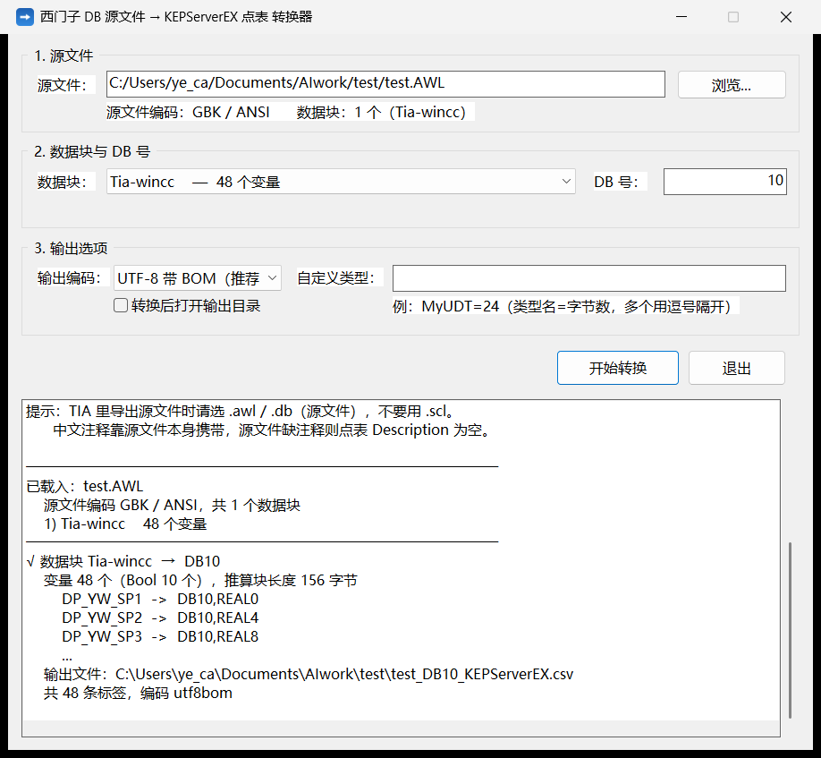

# DB2KepServerEX

把西门子 S7 DB 源文件（`.awl` / `.db`）转换成 **KEPServerEX** 可直接导入的点表 CSV。

适用 **S7-300/400 经典块**，以及 **S7-1200/1500 的非优化块**。

Windows 单文件 exe，**零依赖**（目标机器不用装 Python / .NET / 任何运行库），中文全程不乱码。

> Convert Siemens S7 DB source files (`.awl` / `.db`) into KEPServerEX-importable tag CSV.
> Windows single-file executable, zero dependencies, full Chinese (GBK / UTF-8 / UTF-16) support.



## 解决什么问题

从 TIA Portal / STEP7 导出的 DB 是结构化文本，而 KEPServerEX 要的是 `DB10,REAL0` 这样的地址语法：

```
DATA_BLOCK "Line"                  →     Tag Name,Address,Data Type,...
STRUCT                                   Cmd_Start,"DB10,X0.0",Boolean,...
   Cmd_Start  : BOOL ;                   Cmd_Stop,"DB10,X0.1",Boolean,...
   Cmd_Stop   : BOOL ;                   Speed_Set,"DB10,REAL12",Float,...
   Speed_Set  : REAL ;                   ...
```

手工翻译几十上百个变量既慢又容易错 —— 尤其是 **BOOL 的位偏移**和**多字节类型的字对齐跳字节**
（`REAL` 不能落在奇数字节上，算错一个后面全错）。本工具按 S7-300/400 经典（非优化）DB 的布局规则
自动推算偏移，直接生成 17 列标准 CSV。

## 适用范围

| CPU 系列 | 能不能用 | 说明 |
|---|---|---|
| **S7-300 / S7-400** | ✅ 可以 | 用经典（非优化）DB —— STEP7 导出的 DB 默认就是 |
| **S7-1200 / S7-1500** | ✅ 可以 | DB 必须**取消勾选「优化的块访问」**，见下 |
| 优化块（任意系列） | ❌ 不行 | 优化块没有固定绝对偏移，请改用 Siemens S7 Plus 驱动（符号寻址） |

**为什么 1200/1500 也能用**：西门子保证非优化（"经典"）块的内存布局在 1200/1500 与 300/400 之间是一致的
—— BOOL 按位紧凑、多字节类型字对齐、`STRING` 是 2 字节头 + n 字符。KEPServerEX 的 Siemens TCP/IP
驱动文档本身也是按 `S7-300/400/1200/1500` 一起写的，所以同一套偏移规则直接适用。

**用 1200/1500 时要做的三件事：**

1. **取消「优化的块访问」。** 1200/1500 里新建 DB 默认就是优化访问的，要在 DB 属性里把这个勾去掉再编译。
   工具会检查 TIA 导出文件里的 `{ S7_Optimized_Access := 'TRUE' }` 并弹警告要你确认。
2. **放开 PUT/GET。** CPU 属性 → 防护与安全 → 连接机制，勾上「允许来自远程对象的 PUT/GET 通信访问」
   （1200/1500 默认是禁止的，300/400 一般也要勾，但没这么严）。
3. **用 TIA 的偏移列抽查几个点。** 非优化块在 DB 编辑器里能显示每个变量的「偏移量」列，
   重点对一下 **BOOL 段之后的第一个 REAL** 和 **STRUCT 嵌套边界** —— 这两处最容易出现跳字节。

> 1200/1500 独有的一些类型（`LReal`、`LInt`、`ULInt`、`LWord`、`DTL`）本工具已覆盖。
> `WString` 只按长度占位、不生成标签 —— KEPServerEX 的 Siemens TCP/IP 与 Plus 驱动都不支持 WSTRING。

## 特性

- 按 **S7-300/400 经典（非优化）块**的布局规则计算偏移：BOOL 按位紧凑排列，多字节类型落在偶数字节。
  同一套规则适用于 **S7-1200/1500 的非优化块**（见上一节）
- **源文件编码自动识别**：UTF-8（带/不带 BOM）、UTF-16、GBK，不需要手动选
- 支持嵌套 `STRUCT`（自动展平成 `父结构_子变量`）、`ARRAY[a..b] of T`、`STRING[n]`
- 24 种标量类型 + 常见结构体类型占位
- **优化块检测**：遇到 `S7_Optimized_Access := 'TRUE'` 会告警并中止，不会静默生成错地址
- **标签名合规检查**：检出 KEPServerEX 不允许的字符（`.` `"` 开头的 `_` 首尾空格）和重名
- 一个源文件里有多个 `DATA_BLOCK` 时可以选块转换
- 遇到长度无法确定的类型（自定义 UDT）会**明确报错中止**，不会带着错位的偏移继续生成
- 窗口版 + 命令行版，共用同一份核心代码，两者输出**逐字节一致**
- 纯 Win32 API，无第三方依赖；exe 单文件约 1.9 MB

## 获取

本仓库只包含源码，不含编译好的 exe。可以到 [Releases](../../releases) 页面看看有没有现成的二进制，
或者按下节自行编译（一条命令的事）。

### 编译

需要 [Go](https://go.dev/dl/) 1.20+（本机实测 1.27）和 Python 3（仅用于生成图标资源）。

```bash
# 1. 生成界面资源 app.syso（内嵌图标 + manifest）
python tools/make_resources.py

# 2. 编译窗口版
go build -trimpath -ldflags "-s -w -H windowsgui" -o DB2KepServerEX.exe .

# 3. 编译命令行版
go build -tags cli -trimpath -ldflags "-s -w" -o DB2KepServerEX_cli.exe .
```

Windows 下也可以直接双击 `build.bat`。

> **为什么需要第 1 步**：Go 的链接器不会自动写 Windows manifest，缺了它程序会退回
> Win95 风格的经典控件外观、且在高 DPI 下模糊。`tools/make_resources.py` 用纯 Python
> 手写了一个 x86-64 COFF 目标文件（`.syso`），把 `RT_MANIFEST` + `RT_ICON` + `RT_GROUP_ICON`
> 塞进 `.rsrc` 段，`go build` 会自动识别同目录下的 `.syso`。
> 跳过这步也能编译成功，只是界面难看 —— 所以 `app.syso` 是**生成物，不纳入版本库**。

## 使用

### 窗口版

双击 `DB2KepServerEX.exe`：

1. 点【浏览...】选源文件（也可以直接把文件路径粘进"源文件"框）
2. 选数据块，填这个块的 DB 号
3. 点【开始转换】—— CSV 生成在源文件所在目录

把 `.awl` / `.db` 文件**直接拖到 exe 图标上**也能启动并自动载入；带上 DB 号一起拖也行：
`DB2KepServerEX.exe 文件.awl 10`

### 命令行版

```
DB2KepServerEX_cli.exe <源文件> [DB号] [选项]
```

```bash
DB2KepServerEX_cli.exe D:\test.AWL 10
DB2KepServerEX_cli.exe D:\test.AWL -db 10 -enc ansi
DB2KepServerEX_cli.exe D:\多块文件.awl -block DB_Beta -db 11
DB2KepServerEX_cli.exe D:\test.AWL 10 -types "MyUDT=24"
DB2KepServerEX_cli.exe -listtypes
```

| 选项 | 说明 |
|---|---|
| `-db N` | 数据块的 DB 号（1-65535），等同于位置参数 |
| `-block 名称` | 文件里有多个 `DATA_BLOCK` 时，指定要转换的块（块名或序号） |
| `-enc` | 输出编码，默认 `utf8bom`。`ansi` = GBK(936)，`utf8` = 无 BOM |
| `-o` | 指定输出 CSV 路径；不写则输出到源文件同目录 |
| `-types` | 自定义类型长度，逗号分隔，格式 `名称=字节数`。用于 UDT 等无法自动判断长度的类型 |
| `-listtypes` | 打印支持的数据类型表后退出 |

选项放在文件名前后任意位置都行。输出文件名默认 `<源文件名>_DB<号>_KEPServerEX.csv`。

### 导入 KEPServerEX

左侧树里选中目标 **Device** → 菜单 **File → Import CSV** → 选生成的 CSV。

导入后中文乱码的话，把输出编码改成 `ansi`(GBK) 重转一次再导。

### 示例

`examples/` 里有两个**合成的**示例（不是真实项目数据），可以直接拿来试：

```bash
DB2KepServerEX_cli.exe examples\demo_line.awl 10
DB2KepServerEX_cli.exe examples\demo_station.db 11
```

- `demo_line.awl` —— GBK 编码，24 个变量，含 BOOL / BYTE / INT / DWORD / DINT / REAL /
  STRING / 嵌套 STRUCT / 数组 / TIME / DT，块长 84 字节
- `demo_station.db` —— UTF-8 BOM 编码，10 个变量，块长 48 字节

## 支持的数据类型

用 `-listtypes` 可随时打印完整表。

### 标量类型 —— 直接生成标签

| Siemens 类型 | 字节 | 生成的地址 | CSV Data Type |
|---|---|---|---|
| `Bool` | 1 位 | `DB10,X104.0` | Boolean |
| `Byte` / `USInt` | 1 | `DB10,B46` | Byte |
| `Char` / `SInt` / `SByte` | 1 | `DB10,C46` | Char |
| `Word` / `UInt` / `S5Time` | 2 | `DB10,W40` | Word |
| `Int` | 2 | `DB10,I40` | Short |
| `Date` | 2 | `DB10,DATE40` | String |
| `DWord` / `UDInt` | 4 | `DB10,D42` | DWord |
| `DInt` | 4 | `DB10,DI42` | Long |
| `Real` | 4 | `DB10,REAL0` | Float |
| `Time` / `Tod` / `Time_Of_Day` | 4 | `DB10,TIME0` | String |
| `DT` / `Date_And_Time` | 8 | `DB10,DT0` | String |
| `LReal` | 8 | `DB10,LREAL0` | Double |
| `LInt` / `ULInt` | 8 | `DB10,LINT0` | LLong |
| `LWord` | 8 | `DB10,LWORD0` | QWord |
| `String[n]` | n+2 | `DB10,STRING22.16` | String |

### 结构体类型 —— 只占位推进偏移，不生成标签

`IEC_TIMER`/`TON`/`TOF`/`TP`/`TONR`(16)、`IEC_COUNTER`/`CTU`/`CTD`/`CTUD`(6)、
`IEC_SCOUNTER`/`IEC_USCOUNTER`(3)、`IEC_DCOUNTER`/`IEC_UDCOUNTER`(12)、
`DTL`(12)、`LTIME`/`LDT`(8)、`WString[n]`、`ERROR_STRUCT`(28)、`CREF`/`NREF`(8)、
`VREF`(12)、`CONDITIONS`(52)、`TADDR_Param`/`TCON_Param`、`Pointer`、`Any`、`Void`

> 这些类型在 Kepware 的 Siemens 驱动里没有单一地址写法，所以程序只按官方长度把偏移推过去，
> 不生成标签，并在结果里列出来。要读它们内部的具体成员（比如 TON 的 ET），需要对照 TIA
> 里的实际布局手动补几条。

## 地址是怎么算出来的

依据 Kepware *Siemens TCP/IP Ethernet* 驱动帮助文档的
`Standard S7-300/400/1200/1500 Item Syntax`：

```
DB 内存区：  DB<num>,<S7 data type><address>[.<bit>]
```

**偏移规则（S7-300/400 经典块，S7-1200/1500 非优化块同样适用）**

- `Bool` 按位紧凑排，8 位占满一个字节
- 多字节类型必须落在**偶数字节**上（字对齐），字节数为奇数时自动跳一格
- 例：`Bool` 占完 `104.0` / `104.1` 后，下一个 `Real` 因 105 是奇数被跳过，落在 **106**

### CSV 列结构

标准 17 列，顺序与 KEPServerEX 官方导出模板一致：

```
Tag Name, Address, Data Type, Respect Data Type, Client Access, Scan Rate, Scaling,
Raw Low, Raw High, Scaled Low, Scaled High, Scaled Data Type,
Clamp Low, Clamp High, Eng. Units, Description, Negate Value
```

固定取值：`Respect Data Type`=1、`Client Access`=Read/Write、`Scan Rate`=1000、
`Scaling`=None、`Description`=源文件里的注释。含逗号的地址已按 CSV 规范用双引号包裹。

## 标签名能不能用中文

**规则上可以，实际用起来有坑。**

PTC 官方帮助 *Properly Name a Channel, Device, Tag, and Tag Group* 里，
KEPServerEX 对标签名（以及通道名、设备名、组名）的保留 / 受限字符只有四个：

| 受限 | 说明 |
|---|---|
| 英文句点 `.` | 别名里用它分隔通道名和设备名（`通道.设备`） |
| 双引号 `"` | |
| **开头**的下划线 `_` | 从第 2 个字符起可以用，`Tag_1` 合法 |
| 名称首尾的空格 | 中间空格可以用，`Tag 1` 合法 |

**官方没有禁止非 ASCII 字符**，即中文标签名在规则层面是允许的。但实际能不能用，看链路：

| 链路 | 中文标签名 | 说明 |
|---|---|---|
| OPC UA | 基本可用 | 名字按 UTF-8 传输。但 KEPServerEX 会用标签名生成 NodeId，中文会出现在 NodeId 里，手写或拼接 NodeId 的场合容易出错 |
| OPC DA | 有风险 | 底层是 COM / ANSI，Item ID 按本地代码页传递。中文 Windows 下一般能用，客户端换区域设置就会乱码 |
| 老组态软件（组态王、力控等） | 不建议 | 对中文 Item ID 支持不一致 |

**建议：标签名用英文 / 拼音，中文放 Description 列。**

本工具默认就是这么做的 —— DB 里的**变量名**进 Tag Name，**注释**进 Description 列。
KEPServerEX 和多数 OPC 客户端都能读到 Description，人看中文、机器看英文，最稳。

程序会替你检查：生成的标签名踩到上面四条限制（比如变量叫 `_Temp`），或者嵌套结构展平后撞名，
结果里都会明确列出来，不会静默生成一个导不进去的点表。

> 另外：PLC 里的 `STRING` 是 ANSI 编码，`WSTRING` 才是 Unicode。
> KEPServerEX 的 Siemens TCP/IP 与 Siemens Plus 驱动**都不支持 `WSTRING`**，
> 想读 PLC 里的中文字符串内容，得用 PLC 自带的 OPC UA 服务器 + KEPServerEX 的
> OPC UA Client 驱动。（这是"读 PLC 里的中文数据"，和"标签名用中文"是两回事。）

## 注意事项 / 已知限制

1. **优化块不能用。** 源文件里若有 `S7_Optimized_Access := 'TRUE'`，程序会告警并要求确认。
   优化块没有固定绝对偏移，算出来的地址在 PLC 里是无效的 —— 这种块请改用符号寻址
   （KEPServerEX 的 Siemens S7 Plus 驱动）。源文件里**没写**这个属性时按「非优化」处理
   （STEP7 经典块就是这样）。
2. **DB 号要填对。** 填错了整张点表都是错的，导入前核对一次。
3. **PLC 侧前提：** DB 必须是非优化块；CPU 属性里勾选「允许来自远程对象的 PUT/GET 通信访问」。
4. **只支持 Windows。** 核心代码用 `syscall` 直接调 `kernel32.dll` 做编码转换和 UTF-16 输出，
   没有做跨平台抽象。
5. **结构体类型不展开。** `TON`、`IEC_COUNTER`、`DTL`、`Pointer` 等只按官方长度占位推进偏移，
   不生成标签。若你的 CPU 型号 / 固件下长度不同，用 `-types` 覆盖。
6. **偏移是按「经典非优化 DB」推算的。** 若源文件里的变量声明顺序与 PLC 里实际布局不一致
   （例如中间插过变量又删掉），推算结果会与 PLC 不符 —— 导入前建议对照 TIA 的偏移列抽查几个点。

## 仓库结构

```
core.go                     共享核心：编码识别、类型表、DB 解析、偏移计算、CSV 生成（不含界面代码）
gui.go                      窗口版入口（纯 Win32 API，无第三方库）
cli.go                      命令行版入口
go.mod                      模块定义
build.bat                   Windows 一键编译
tools/make_resources.py     生成 app.syso（内嵌图标 + manifest）
tools/md2html.py            Markdown → HTML（用于构建文档 PDF）
docs/                       文档与截图
examples/                   合成的示例源文件与转换结果
```

两个 exe 用 **build tag** 区分（`gui.go` 是 `!cli`，`cli.go` 是 `cli`），共用同一份 `core.go`。
改了 `core.go`，两个 exe 都要重新编一遍。

## 免责声明

- 本项目是**非官方**工具，与 PTC、Siemens 均无关联。
  KEPServerEX 是 PTC Inc. 的商标，SIMATIC / TIA Portal / STEP7 是 Siemens AG 的商标。
- 生成的地址是按 S7-300/400 经典块（1200/1500 非优化块同规则）**推算**的，不保证与任何特定
  PLC 程序的实际内存布局一致。**用于生产环境前请务必核对地址**，尤其是涉及写操作的标签。
- 软件按 GPL-3.0 分发，不提供任何担保。因使用本工具造成的任何损失，作者不承担责任。

## 许可证

[GPL-3.0-or-later](LICENSE)

This program is free software: you can redistribute it and/or modify it under the terms of the
GNU General Public License as published by the Free Software Foundation, either version 3 of the
License, or (at your option) any later version.

This program is distributed in the hope that it will be useful, but WITHOUT ANY WARRANTY; without
even the implied warranty of MERCHANTABILITY or FITNESS FOR A PARTICULAR PURPOSE. See the
GNU General Public License for more details.
